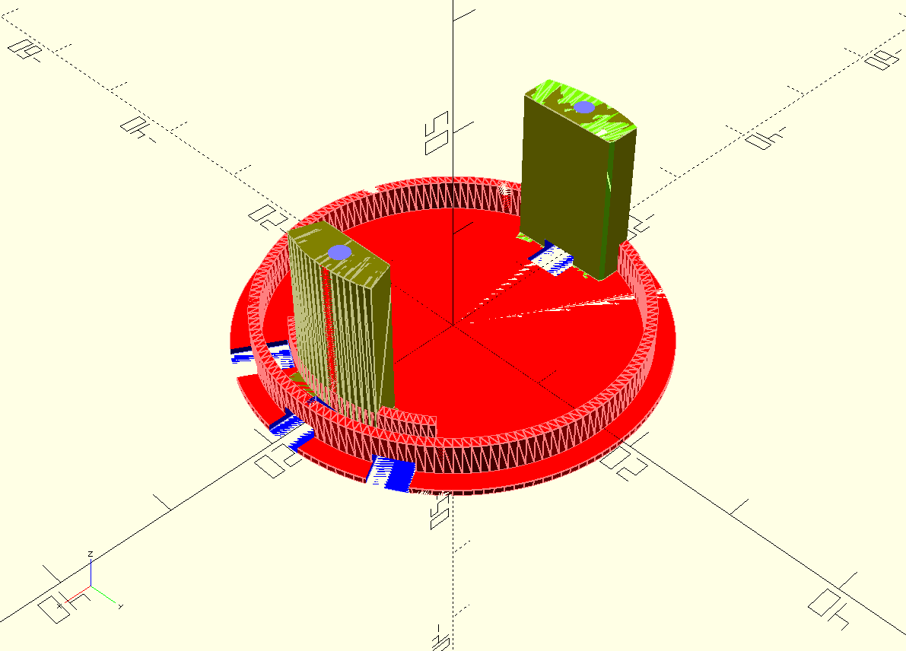

# Servo-Abzweigung

Für CarSystem Strecken mit 3mm Magnetband.

Die Halterung ist für SG90 Tower Servos ausgelegt, die Anzahl und Position der Abgänge kann als Parameter übergeben werden. 

Im Ordner liegt auch noch eine erste Version die mit FreeCAD erstellt wurde.
